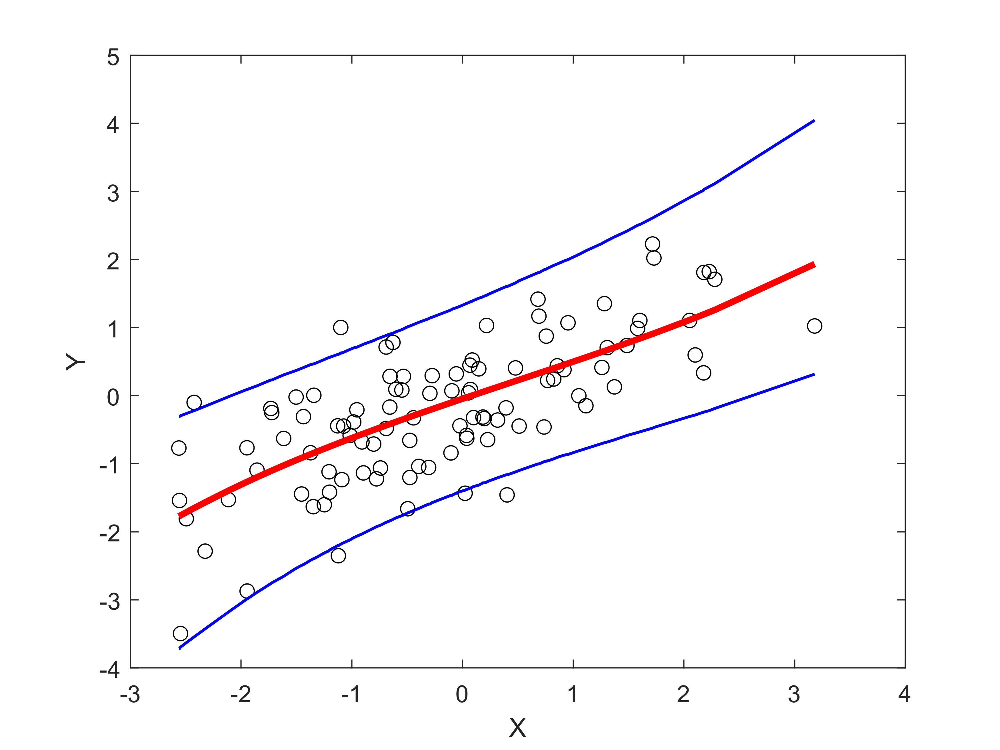
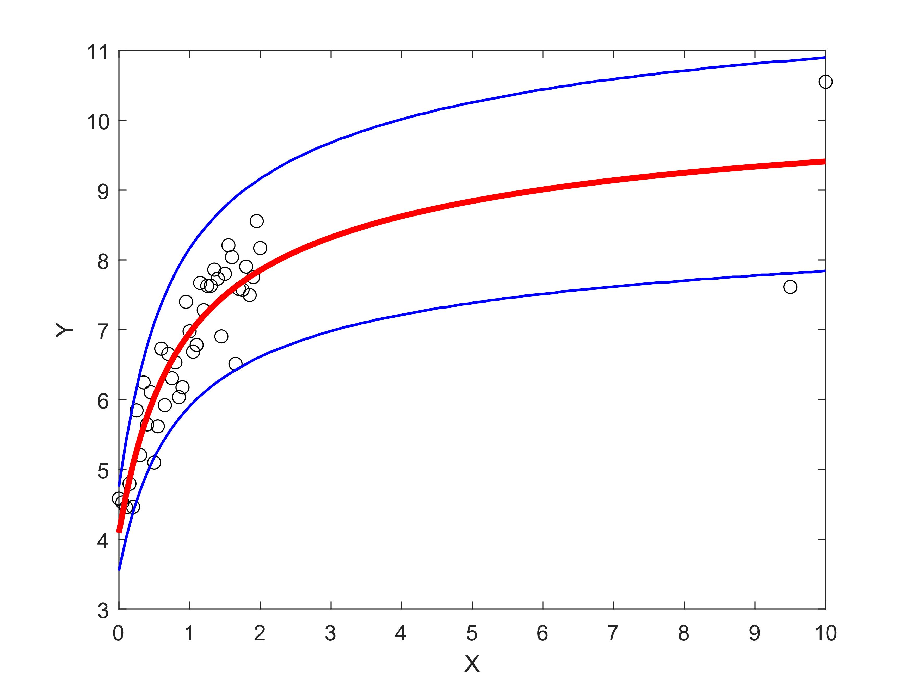

# Copula Regression (One predictor)

Now, we move on to one of the applications of copula: regression.

## Load data

Define predictor data x and response y.

```matlab
load stockreturns
x = stocks(:,2);
y = stocks(:,1);
```

## Perform regression

Use that data to perform a regression.

```matlab
[yhat,CI] = copreg(x,y,'xpred',x,'ypred',y);
```

```plaintext
% ===== OUTPUT ======
Case: 1-predictor
Method: Bivariate copula
Regression Progress: 100.00%
Data length for fitting = 100
Data length for predicting = 100
Evaluation Results:
RMSE = 0.72001
MAPE = 5.2814
wMAPE = 0.70893
```



## Another Example
Let's look at an example for other data.

```matlab
load polydata
x = x(:);
y = y(:);
[yhat,CI] = copreg(x,y); % Only Perform the regression without predict data
```

```plaintext
% ===== OUTPUT ======
Case: 1-predictor
Method: Bivariate copula
Regression Progress: 100.00%
Data length for fitting = 43
```



**Download**: this example is available on `demo3.m`. [Visit Github](https://github.com/mkhoirun-najiboi/mycopula)

---
[< Home](home.md)\
[< Menu](home.md#menu)\
[**View on Github**](https://github.com/mkhoirun-najiboi/mycopula)

[Visit my personal blog](https://emkanajib.blogspot.com/)\
@ 2021-2023 Mohamad Khoirun Najib
