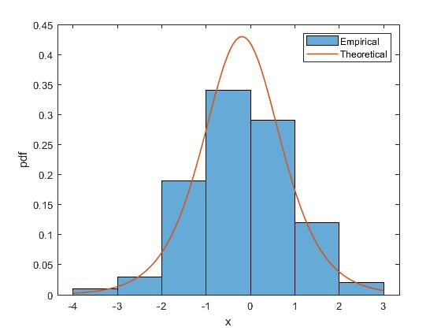

# Fitting Bivariate Copula

Now let's start with the most basic thing which is how to fit the bivariate copula.

mycopula provides a very easy way to fit a bivariate copula. This will automatically output the most appropriate marginal distribution and copula functions from the [listed functions](home.md).

**Load Data**\
Let's use the dataset provided by MATLAB, namely `stockreturns`, which consists of 10 observations from 10 stock assets.
```matlab
load stockreturns

x1 = stocks(:,1);
x2 = stocks(:,2);
```

## Marginal Distribution

The first step of the IFM method is to fit the distribution of each margin that will be used to fit the copula function. This is provided by the `fitter` function.

- `fitter(x)`: returns the fittest distribution of a vector column x.
- `fitter(x,'sortby','value')`: returns the fittest distribution of a vector column x, based on the `sortby` measurement. `'value'` can be `'aic'`, `'adstat'` (_default_), or `'kstat'`.
- `fitter(x,'verbosity',value)`: returns the fittest distribution of a vector column x, with printing information about the fitting process. `value` can be 0 (prints no information), 1 (prints selected distribution information, _default_), or 2 (prints full information).
- `fitter(x,'plotby',value)`: returns the fittest distribution of a vector column x, with outputting a comparison plot between the PDF of the selected distribution and its empirical histogram. 0 (default) no, or 1 yes.

The following is a selected distribution of data `X1` and `X2`.

```matlab
F1 = fitter(x1);
```

```plaintext
Domain = Real
Sort by = Anderson-Darling Stastistics
fittest distribution = Logistic
Parameters: mu = -0.19364, sigma = 0.58158
Decision: fails to reject h0 (AD pval=0.9990)
```

```matlab
F2 = fitter(x2);
```

```plaintext
Domain = Real
Sort by = Anderson-Darling Stastistics
fittest distribution = Generalized Extreme Value
Parameters: k = -0.21362, sigma = 1.1975, mu = -0.66838
Decision: fails to reject h0 (AD pval=0.9949)
```

Then, here is an example of just outputting the PDF plot without printing the information.
```matlab
fitter(x1,'verbosity',0,'plotpdf',1);
```


**Probability Transformation**\
From the selected distribution function, the initial variable is transformed into a $\text{uniform}\sim(0,1)$ distribution.
```matlab
u1 = cdf(F1,x1);
u2 = cdf(F2,x2);
```

## Copula Fitting

The second step in the IFM method is to fit the copula function using transformed variables. This is provided by the `copfitter` function.

- `copfitter(U)` returns the fittest copula of the matrix composed of the column vectors of the transformed variables. In the bivariate case, `U` can be written as `[u1,u2]`.
- `copfitter(U,'sortby','value')` returns the fittest copula, based on the `sortby` measurement. `'value'` can be `'aic'` (_default_), `'rmse'`, or `'cvm'`.
- `copfitter(U,'verbosity',value)` returns the fittest copula, with printing information about the fitting process. `value` can be 0 (prints no information), 1 (prints selected distribution information, _default_), 2 (prints top five copulas information), or 3 (prints full information).

This is an example of fitting a copula from a previously obtained variable.

```matlab
C = copfitter([u1,u2],'verbosity',3);
```

```plaintext
Case = Bivariate
Sort by = Akaike Information Criterion
Fittest copula = Gaussian
Parameter(s): param1 = 0.72231
Decision: fails to reject h0 (CvM pval=0.7361)
Summary = 
 
       copulaName         param1           param2           CvM        pValue       RMSE        AIC  
    ________________    ___________    _______________    ________    ________    ________    _______

    {'Gaussian'    }        0.72231    {0×0 double   }    0.020551      0.7361    0.014336    -71.733
    {'Galambos'    }         1.2566    {0×0 double   }    0.022314     0.72827    0.014938    -70.995
    {'Gumbel'      }         1.9657    {0×0 double   }    0.022681     0.72665     0.01506    -70.395
    {'t'           }        0.72216    {[ 2.9046e+06]}    0.020562     0.73605     0.01434    -69.733
    {'BB1'         }        0.17369    {[     1.8277]}    0.021673     0.73111    0.014722    -69.294
    {'BB1-180'     }        0.80836    {[     1.3924]}    0.023205     0.72435    0.015233    -69.126
    {'BB6'         }              1    {[     1.9657]}    0.022681     0.72666     0.01506    -68.395
    {'BB7-180'     }         1.4889    {[     1.3188]}    0.029178      0.6986    0.017082     -68.19
    {'BB8'         }         4.0639    {[     0.8401]}    0.022983     0.72533     0.01516    -66.407
    {'Frank'       }         5.7461    {0×0 double   }    0.023802     0.72174    0.015428    -64.383
    {'Clayton-180' }         1.5251    {0×0 double   }    0.048519     0.62134    0.022027    -62.997
    {'BB8-180'     }         2040.6    {[     0.0028]}    0.023853     0.72151    0.015444    -62.369
    {'Joe'         }         2.3504    {0×0 double   }    0.055282     0.59639    0.023512     -60.96
    {'Galambos-180'}         1.1221    {0×0 double   }    0.045016     0.63467    0.021217    -59.969
    {'Gumbel-180'  }          1.842    {0×0 double   }    0.044492     0.63669    0.021093    -59.124
    {'BB6-180'     }              1    {[     1.8420]}    0.044491     0.63669    0.021093    -57.124
    {'Clayton'     }         1.1633    {0×0 double   }      0.1095     0.42937    0.033091    -46.108
    {'BB7'         }              1    {[     1.1633]}     0.10949     0.42939     0.03309    -44.108
    {'Joe-180'     }         1.9989    {0×0 double   }     0.12485     0.39125    0.035333    -41.478
    {'Galambos-90' }      -0.015625    {0×0 double   }     0.67122    0.014272    0.081928          2
    {'Galambos-270'}     -0.0055666    {0×0 double   }     0.67122    0.014272    0.081928          2
    {'Joe-270'     }             -1    {0×0 double   }     0.67122    0.014272    0.081928          2
    {'Joe-90'      }             -1    {0×0 double   }     0.67122    0.014272    0.081928          2
    {'Clayton-270' }    -1.4509e-06    {0×0 double   }     0.67122    0.014272    0.081928     2.0002
    {'Gumbel-270'  }             -1    {0×0 double   }     0.67122    0.014272    0.081928     2.0002
    {'Gumbel-90'   }             -1    {0×0 double   }     0.67122    0.014272    0.081928     2.0003
    {'BB8-270'     }             -1    {[    -1.0000]}     0.67122    0.014272    0.081928          4
    {'BB8-90'      }             -1    {[    -0.9985]}     0.67122    0.014272    0.081928          4
    {'BB6-90'      }             -1    {[         -1]}     0.67122    0.014272    0.081928          4
    {'BB6-270'     }             -1    {[         -1]}     0.67122    0.014272    0.081928          4
    {'BB7-270'     }             -1    {[-9.0917e-10]}     0.67122    0.014272    0.081928     4.0001
    {'BB7-90'      }             -1    {[-1.5837e-08]}     0.67122    0.014272    0.081928     4.0001
    {'BB1-90'      }    -2.2632e-09    {[    -1.0000]}     0.67122    0.014272    0.081928     4.0001
    {'BB1-270'     }    -9.0917e-10    {[    -1.0000]}     0.67122    0.014272    0.081928     4.0001
```

**Download**: this example is available on `demo1.m`. [Visit Github](https://github.com/mkhoirun-najiboi/mycopula)

---
[< Home](home.md)\
[< Menu](home.md#menu)\
[**View on Github**](https://github.com/mkhoirun-najiboi/mycopula)

[Visit my personal blog](https://emkanajib.blogspot.com/)\
@ 2021-2023 Mohamad Khoirun Najib
