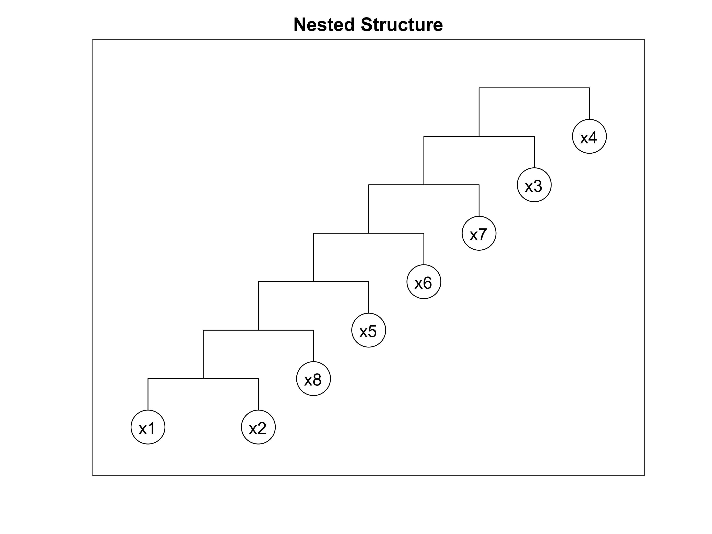

# Fully Nested Copula

```matlab
load stockreturns

x = stocks(:,1:8);
C = nestedfit(x);
```

```plaintext
# ===== OUTPUT ======
Permutation: 1  2  8  5  6  7  3  4
Marginal Distribution: 
 No. 1 (x1): Dist Name = Logistic
             mu = -0.19364, sigma = 0.58158
 No. 2 (x2): Dist Name = Generalized Extreme Value
             k = -0.21362, sigma = 1.1975, mu = -0.66838
 No. 3 (x8): Dist Name = Generalized Extreme Value
             k = -0.42089, sigma = 1.1398, mu = -0.44746
 No. 4 (x5): Dist Name = Logistic
             mu = -0.01735, sigma = 0.56663
 No. 5 (x6): Dist Name = Generalized Extreme Value
             k = -0.37109, sigma = 1.3661, mu = -0.49014
 No. 6 (x7): Dist Name = Logistic
             mu = 0.22276, sigma = 0.94414
 No. 7 (x3): Dist Name = Generalized Extreme Value
             k = -0.36064, sigma = 1.6488, mu = -0.92152
 No. 8 (x4): Dist Name = Normal
             mu = -0.00058728, sigma = 2.359

Case = Fully Nested Copula
Selected by = Akaike Information Criterion
Nested Layers:
 No. 1: Copula Name = Gaussian
        param1 = 0.72231
 No. 2: Copula Name = Frank
        param1 = 2.961
 No. 3: Copula Name = Galambos
        param1 = 0.43143
 No. 4: Copula Name = Clayton
        param1 = 0.12805
 No. 5: Copula Name = Clayton
        param1 = 0.056506
 No. 6: Copula Name = Clayton
        param1 = 0.026585
 No. 7: Copula Name = Galambos-180
        param1 = 0.11816
Goodness-of-fits:
 AIC (Joint PDF) = 2644.4
 CvM  = 0.036
 RMSE = 0.019
 pVal = 0.669
 ```
 


**Download**: this example is available on `demo5.m`. [Visit Github](https://github.com/mkhoirun-najiboi/mycopula)

---
[< Home](home.md)\
[< Menu](home.md#menu)\
[**View on Github**](https://github.com/mkhoirun-najiboi/mycopula)

[Visit my personal blog](https://emkanajib.blogspot.com/)\
@ 2021-2023 Mohamad Khoirun Najib
