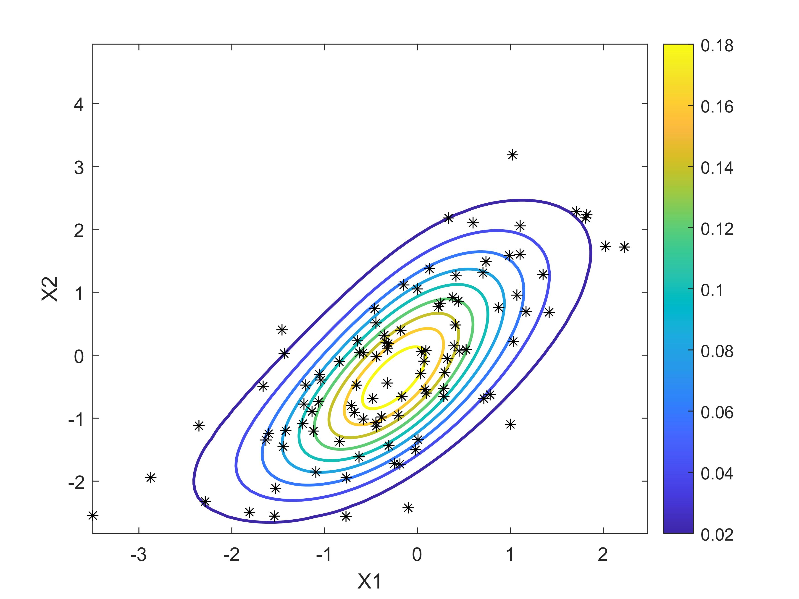
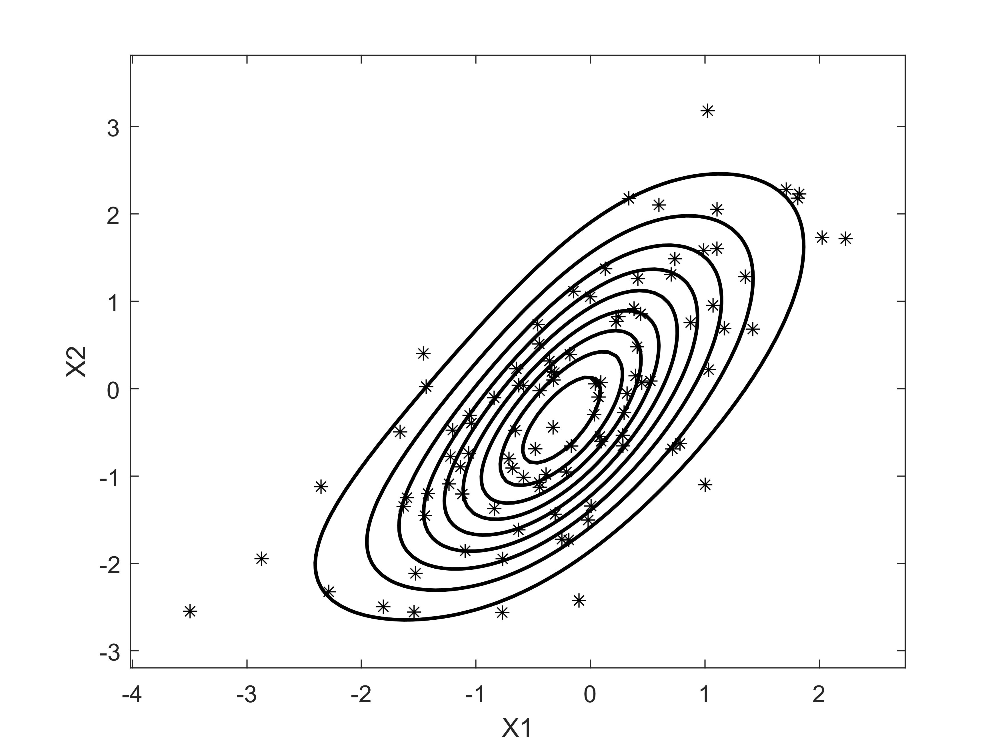

# Joint Probability Density Function and Its Visualization

After knowing how to fit a copula, now we learn how to estimate the joint distribution (joint CDF) and joint density function (joint PDF) values.

**Load Data**\
With the same example data as before, here is how.

```matlab
load stockreturns
x = stocks(:,1:2);
C = bivariatefit(x,'verbosity',0); # to not display result information
```

## Return the Joint CDF and Joint PDF
It is very simple to return the value with

```matlab
jcdf = jointcdf(C,x);
jpdf = jointpdf(C,x);
```

## Visualize the Joint PDF

**Only the contour plot**

```matlab
load stockreturns
x = stocks(:,1:2);
biplot(x);
```



**Contour plot with data**

```matlab
biplot(x,'showdata',1,'showtext','off');
```



**Download**: this example is available on `demo2.m`. [Visit Github](https://github.com/mkhoirun-najiboi/mycopula)


---
[< Home](home.md)\
[< Menu](home.md#menu)\
[**View on Github**](https://github.com/mkhoirun-najiboi/mycopula)

[Visit my personal blog](https://emkanajib.blogspot.com/)\
@ 2021-2023 Mohamad Khoirun Najib
