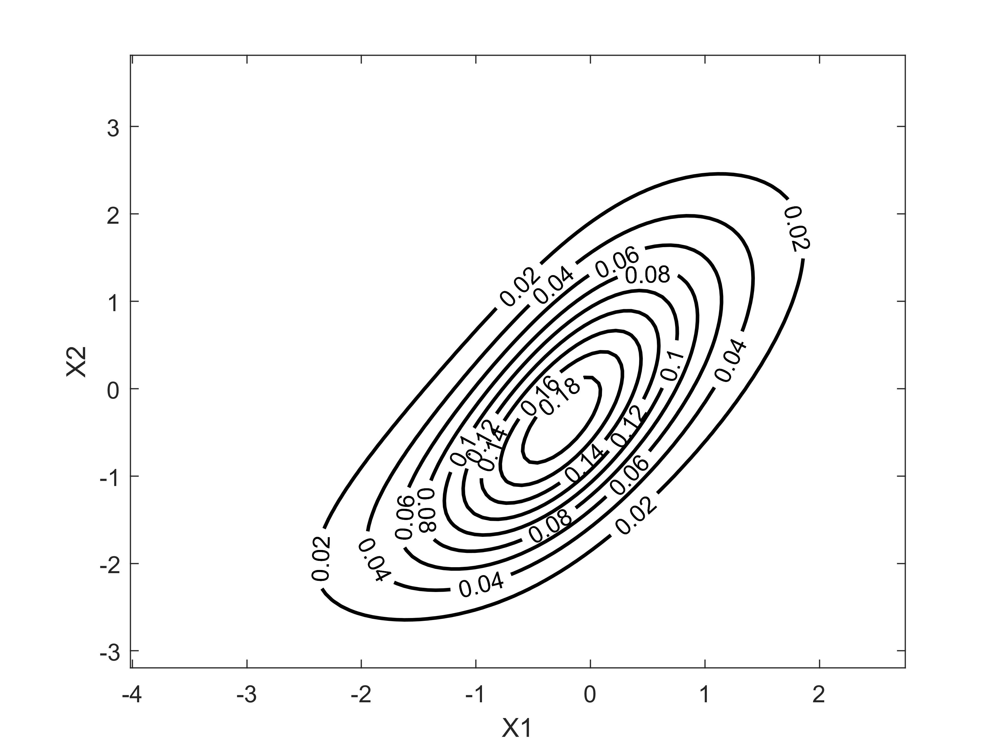

# Joint Probability Density Function and Its Visualization

```matlab
load stockreturns
X1 = stocks(:,1);
X2 = stocks(:,2);
```

```matlab
F1 = fitter(X1); U1 = cdf(F1,X1);
F2 = fitter(X2); U2 = cdf(F2,X2); 
C = copfitter([U1,U2]);
```

```matlab
x1 = 0:0.01:1;
x2 = 0:0.01:1;
[u1,u2] = meshgrid(x1,x2);
cx = evalcopula(C,[u1(:),u2(:)],'pdf');
cx = reshape(cx,[length(x1),length(x2)]);
cx = cx';
x1 = icdf(F1,u1);f1 = pdf(F1,x1);
x2 = icdf(F2,u2);f2 = pdf(F2,x2);
fx = f1.*f2.*cx;

hold on;box on
contour(x1,x2,fx,'linewidth',1.5)
colorbar
plot(X1,X2,'k*')
xlabel('X1')
ylabel('X2')
```


**Download**: this example is available on `demo2.m`. [Visit Github](https://github.com/mkhoirun-najiboi/mycopula)


---
[< Home](home.md)\
[< Menu](home.md#menu)\
[**View on Github**](https://github.com/mkhoirun-najiboi/mycopula)

[Visit my personal blog](https://emkanajib.blogspot.com/)\
@ 2021-2023 Mohamad Khoirun Najib
